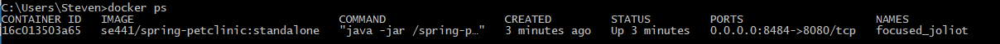
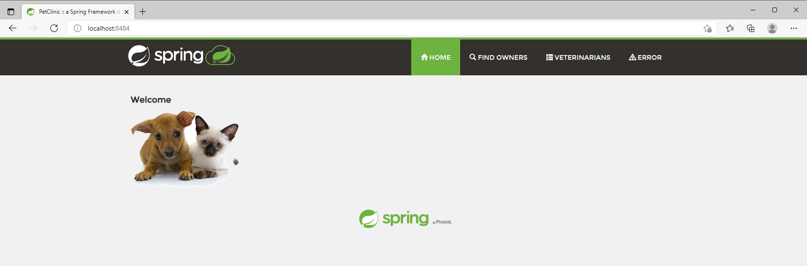
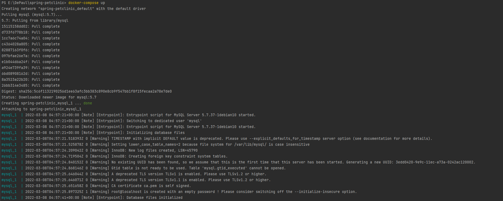
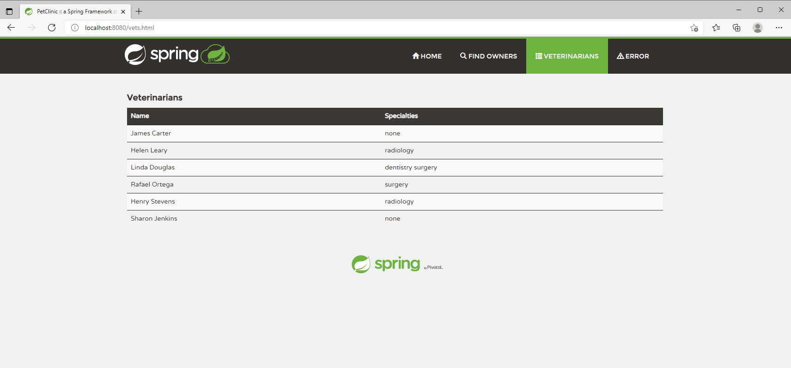
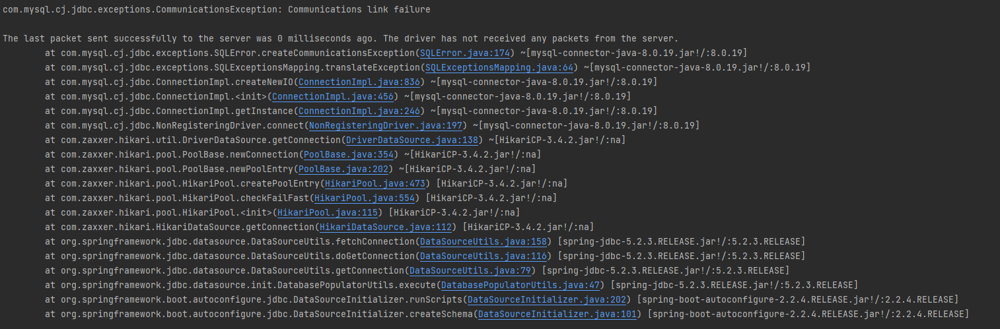
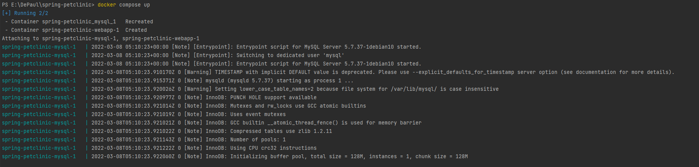
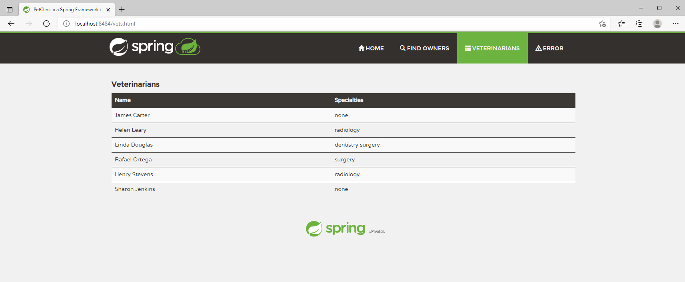

Steven Roderick 2025355

#DOCKER
1. Your dockerfile. Please provide a link to this file rather than a screen capture.
   1. [Dockerfile](./Dockerfile)
2. Your running docker instance as shown by a ps command.
   1. 
3. Your browser accessing the main page of the website from your local container.
   1. 

#Docker Compose - MySQL Only
1. The output from the docker-compose up command.
   1. 
2. Your browser accessing the “Veterinarians” page of the website from your local container when you run the application from the host system.
   1. 
3. A section of the stack trace generated when you attempt to run the application
   container that has been updated to use MySQL.
   1. 

#DOCKER COMPOSE - APP SERVER AND MYSQL
1. Your updated docker-compose.yml file containing the application server, built from
   your local Dockerfile, and the existing MySQL configuration. Please provide a link
   to this file rather than a screen capture.
   1. [docker-compose.yml](./docker-compose.yml)
2. Your updated application-mysql.properties file containing the URL change for
   the database server. Please provide a link to this file rather than a screen capture.
   1. [application-mysql.properties](./src/main/resources/application-mysql.properties)
3. The output from the docker-compose up command.
   1. 
4. Your browser accessing the “Veterinarians” page of the website from your local container.
   1. 

